# CAPTION THIS

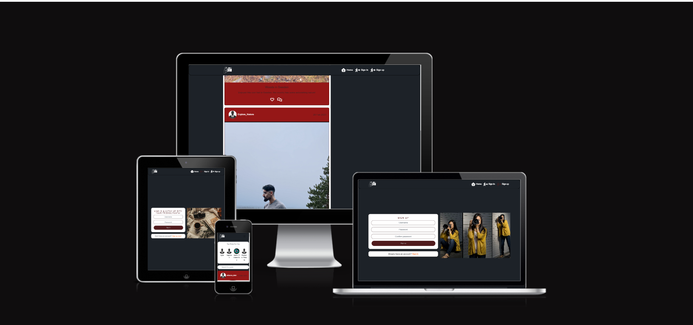

Caption This is my final project submission for Code Institute's programme in Full Stack Software Development.

This website is intended to be a social media platform, where users create their accounts and then upload posts to share with their friends, family or loved ones!

### Colour Scheme

The colors scheme for this project could be better but the main focus I tried emphasizing was the functionality and learning the ReactJS library.

- `#1d2228` used for the background color.
- `#501b1d` used for the buttons.
- `#adadad` used for the buttons hover effect.
- `#FAFAFA` used for the "Top Profile" component.
- `#951717` used for the "Posts" component.

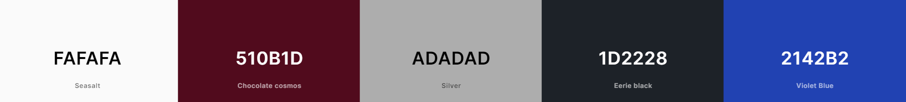

### Typography

- [DM Sans](https://fonts.google.com/specimen/DM+Sans?query=dm+sans) was used for the primary headers and titles.

- [Font Awesome](https://fontawesome.com) icons were used throughout the site, such as the social media icons in the footer.

## User Stories

### New Site Users

- As a new site user, I would like to \***\*create an account**, so that I can \***access all the features for signed up users**.

### Logged in / Returning Site Users

- As a returning site user, I would like to **sign in to the app**, so that I can **access functionality for logged in users.**
- As a returning site user, **I would like to see a list of the most followed profiles**, so that I can **see which profiles are popular**.
- As a returning site user, **I would like to maintain my logged-in status until I choose to log out**, so that I can **my user experience is not compromised**.

- As a returning site user, I would like to **edit my profile** , so that I can **change my profile picture and bio**.

- As a returning site user, I would like to **follow and unfollow other users**, so that I can **see and remove posts by specific users in my posts feed**.

- As a returning site user, I would like to **view content filtered by users I follow**, so that I can **keep up to date with what they are posting about.**

- As a returning site user, I would like to **update my username and password** , so that I can **change my display name and keep my profile secure.**

- As a returning site user, I would like to **view other users profiles** , so that I can **see their posts and learn more about them.**

- As a returning site user, I would like to **read comments on posts**, so that I can **read what other users think about the posts.**

- As a returning site user, I would like to **view the posts I liked ,** so that I can **find the posts I enjoy the most**
- As a returning site user, I would like to **keep scrolling through the images on the site, that are loaded for me automatically** , so that I **don't have to click on "next page" etc**

- As a logged in user, I would like to **create posts,** so that I can **share my images with the world.**

- As a returning site user, I would like to **view the details of a single post,** so that I can **learn more about it.**

- As a returning site user, I would like to **view statistics about a specific user:** **\*bio, number of posts, follows and users followed** so that I can **learn more about them.**

- As a owner of a comment, I would like to **delete my comment** so that I can **control removal of my comment from the application.**
- As a returning site user, I would like to **view other user's profiles** so that I can **easily identify users of the application**.

- As a returning site user, I can **view all the most recent posts**, ordered by **_most recently created first_** so that **I am up to date with the newest content**

- As a logged out user I can **see sign in and sign up options** so that I can **sign in/sign up**

- As a logged in user I can **like a post** so that I can **show my support for the posts that interest me**

- As a user I can **view the posts page** so that I can **read the comments about the post**

- As a user, I can **search for posts with keywords,** so that I can **find the posts and user profiles I am \***most interested**\* in.**

- As a post owner I can **edit my post title and description** so that I can **make corrections or update my post after it was created**
- As a logged in user I can **add comments to a post** so that I can **share my thoughts about the post**

- As an **_owner of a comment_** I can **edit my comment so that I can fix or update my existing comment**

- As a user I can see how long ago a comment was made so that I know how old a comment is

- As a user I can tell if I am logged in or not so that I can log in if I need to

- As a user I can sign in to the app so that I can access functionality for logged in users

- As a user I can navigate through pages quickly so that I can view content seamlessly without page refresh

- As a user I can easily navigate through the site so that I am able to find the specific page I want

### Existing Features

- **Home Page**

  - The home page lets the users see the most recent posts form other users. They can then choose to, **if logged in**, comment or like the post.

  - It also has a search bar, letting the user filter out the posts by search for a more enhanced experience.

  - Because ReactJS was used for this project, I also included the infinite scroll component. This lets the user scroll and constantly get updated without having to refresh the site. Another feature meant to give the user a good experience.

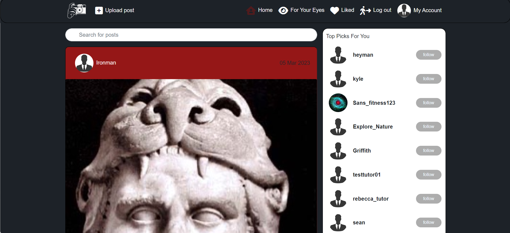

- **NavBar**

  - The NavBar is a react-bootstrap component that I styled to give the user a easy way to find the various pages (which will be covered further down)

  - Consisting of a logo and the other links, it also comes with a conditonal rendering which will change based of the users current sign in status. The screenshots below displays the difference.

- **For Your Eyes**

  - This section/page is where the user will see posts from the people they follow. Intended to help the user to stay up to date with their friends & familys posts.

  - If a user, for some reason, does not follow anybody, a **'not found'** page will appear asking the user to try another keyword or to simply start following other users.

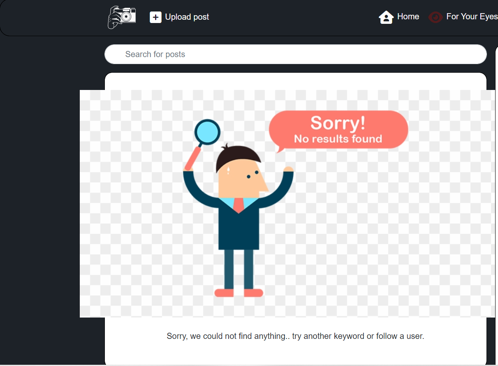

- **Liked posts**

  - Almost the same concept as "For Your Eyes" except this page is for the posts that the user liked. This will ensure that the user only sees the posts he/she liked.

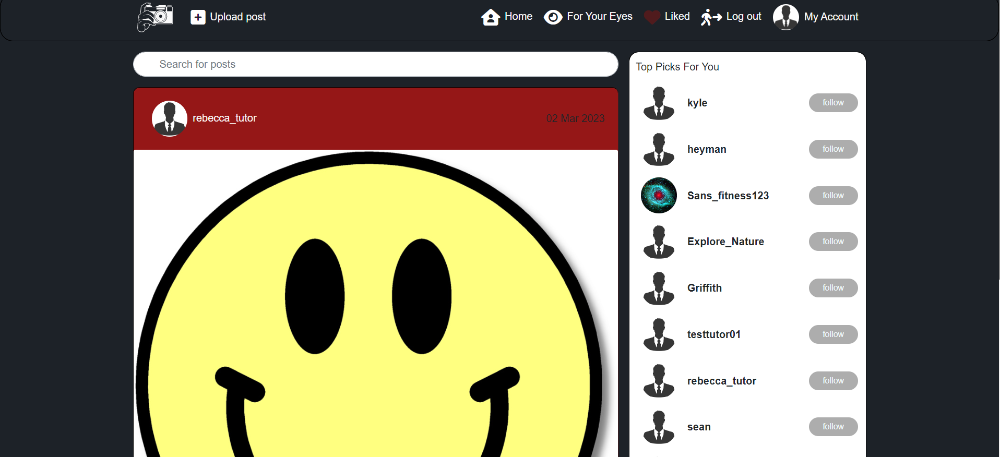

- **Sign up/Sign in**

  - The forms for sign in/ signup look very similar in styling and also how they function, mainly because of simplicity.

  - These two forms also come with authentication which alerts the users with an 'error' message, telling them if they entered a short password, a common password or if they missed other requirements.

  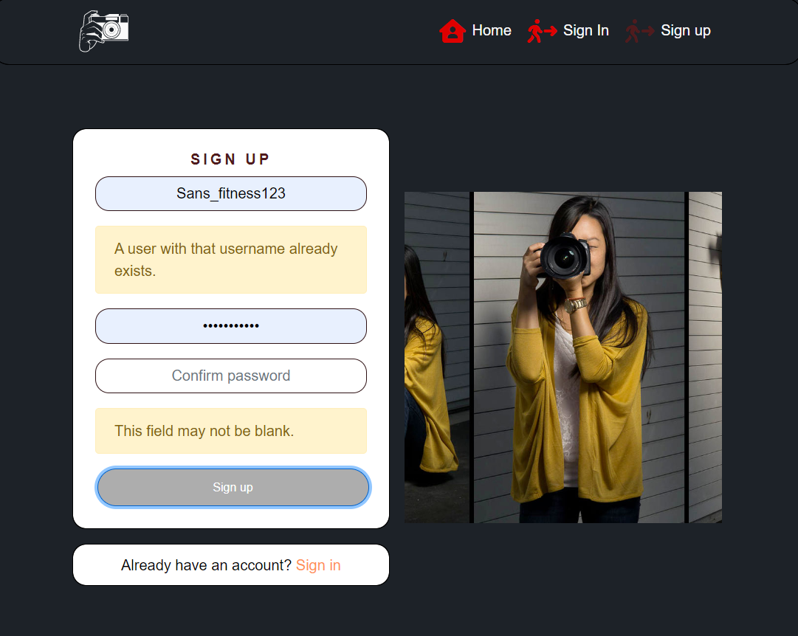
  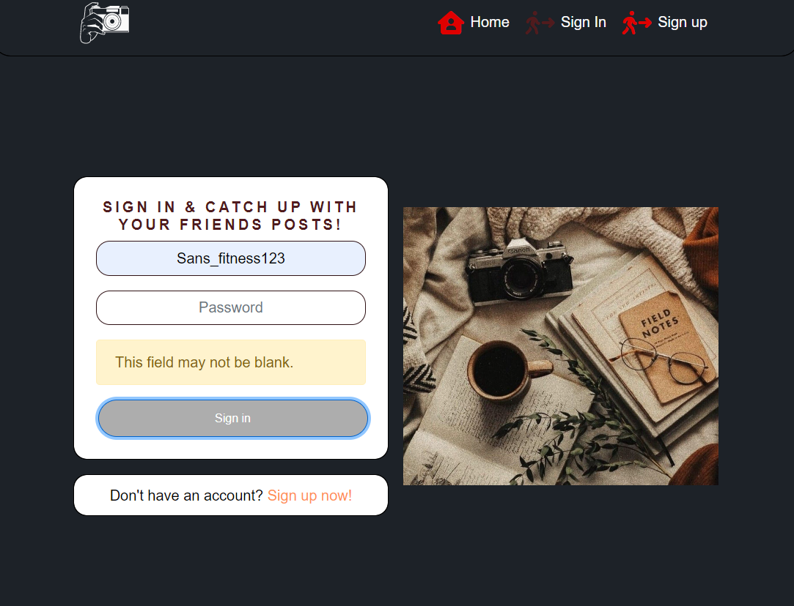

  - If the user creates a successfull account, he/she is greeted by a warm welcoming message

  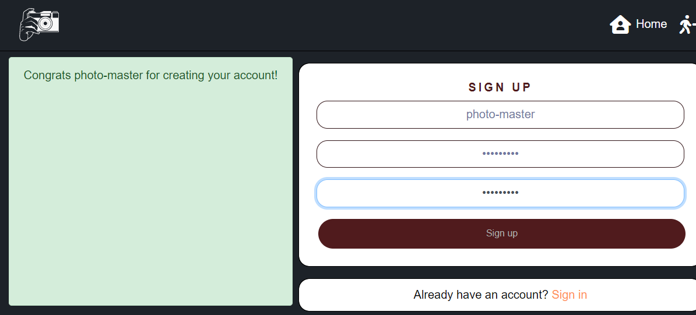
  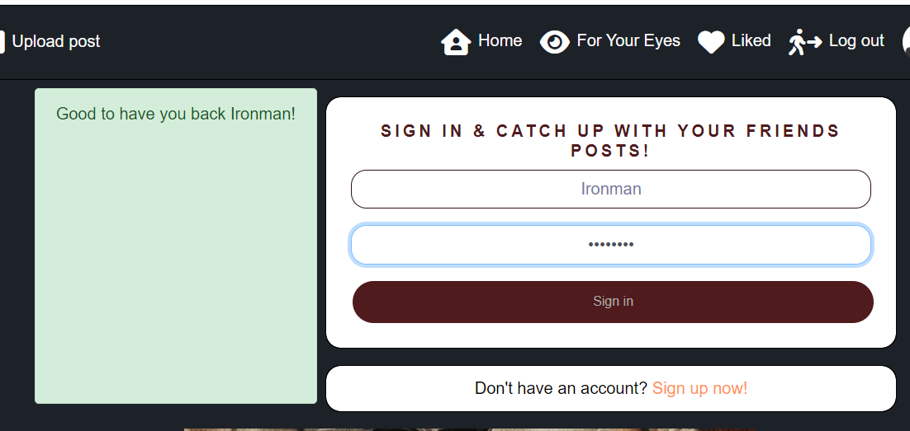

- **My Account**

  - The 'My Account' section provides a user a simple page of their own account.

  - They can then, edit their bio & change their profile picture
    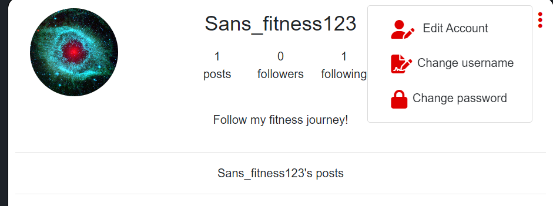
    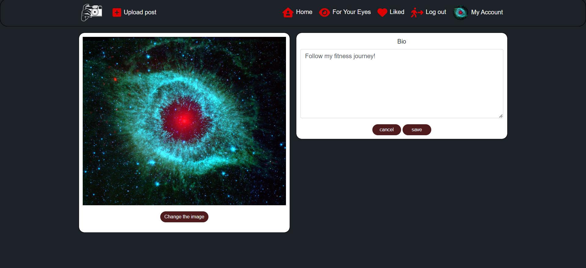

  - Change username
    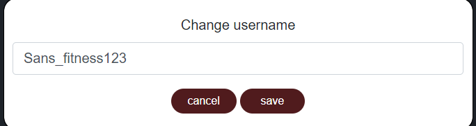

  - Change password
    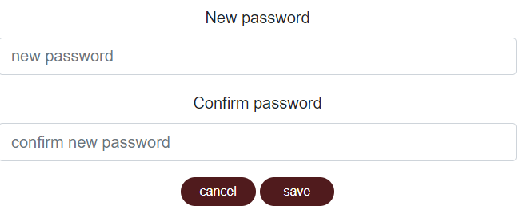

- **Post**

  - Now to the main feature of this application, since people love to post pictures...

  - The 'Post' section is where the users are able to share their beautiful pictures and show them to the world.

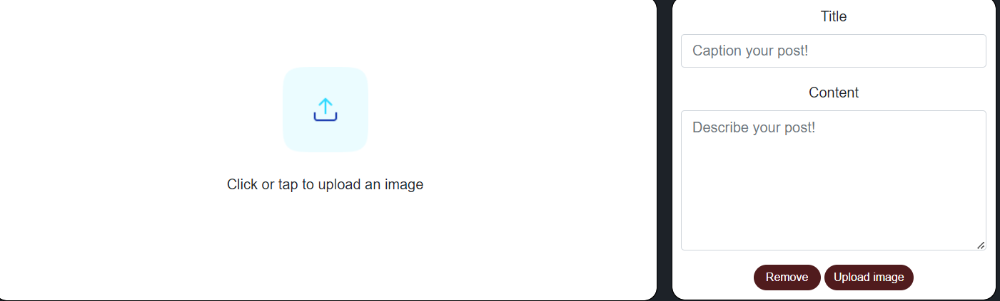

- **Comments**

  - What would this app be worth if you couldn't leave or edit an comment on your friends post?

  - The comment form is simple and stylish, intended to give the ability for a user to comment and share their thought about the post.
    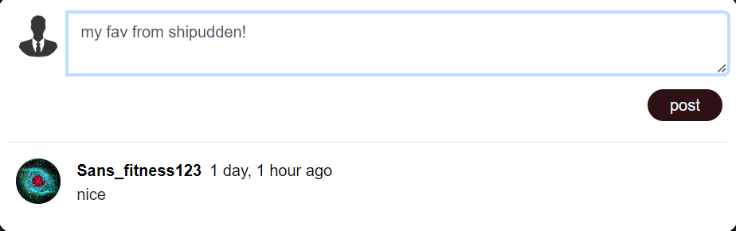

  - And, of course as a user you will have the ability to change and even delete your comment.

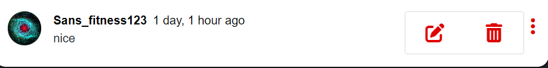

### Future Features

Sadly, because of time constraint, some features were left behind and neglected for this project.
Down below you can read the features that might be in another version!

- Instant message

  - Let's the user message the people they are following.

- Re-post
  - Want your friends to see a post but they don't follow the account? No worries, the Re-post feature is made to simplify this problem!

## Tools & Technologies Used

- [ReactJS](https://reactjs.org/) used as main JS library
- [HTML](https://en.wikipedia.org/wiki/HTML) used for the main site content.
- [CSS](https://en.wikipedia.org/wiki/CSS) used for the main site design and layout.
- [React-Bootstrap](https://react-bootstrap.github.io/) used as the front-end CSS/JS framework for modern responsiveness and pre-built components.
- [JavaScript](https://www.javascript.com) used for user interaction on the site.
- [Python](https://www.python.org) used as the back-end programming language.
- [Git](https://git-scm.com) used for version control. (`git add`, `git commit`, `git push`)
- [GitHub](https://github.com) used for secure online code storage.
- [GitHub Pages](https://pages.github.com) used for hosting the deployed front-end site.
- [Gitpod](https://gitpod.io) used as a cloud-based IDE for development.
- [Markdown Builder by Tim Nelson](https://traveltimn.github.io/markdown-builder) used to help generate the Markdown files.
- [Django REST Framework](https://www.django-rest-framework.org/) used as the Python framework for the site.
- [PostgreSQL](https://www.postgresql.org) used as the relational database management.
- [ElephantSQL](https://www.elephantsql.com) used as the Postgres database.
- [Heroku](https://www.heroku.com) used for hosting the deployed back-end site.
- [Cloudinary](https://cloudinary.com) used for online static file storage.

## Agile Development Process

### GitHub Projects

[GitHub Projects](https://github.com/SanZangana/caption-this/projects) served as an Agile tool for this project.
It isn't a specialized tool, but with the right tags and project creation/issue assignments, it can be made to work.

Through it, user stories, issues, and milestone tasks were planned, then tracked on a weekly basis using the basic Kanban board.

### GitHub Issues

[GitHub Issues](https://github.com/SanZangana/caption-this/issues) served as an another Agile tool.
There, I used my own **User Story Template** to manage user stories.

It also helped with milestone iterations on a weekly basis.

- [Open Issues](https://github.com/SanZangana/caption-this/issues)

- [Closed Issues](https://github.com/SanZangana/caption-this/issues?q=is%3Aissue+is%3Aclosed)

  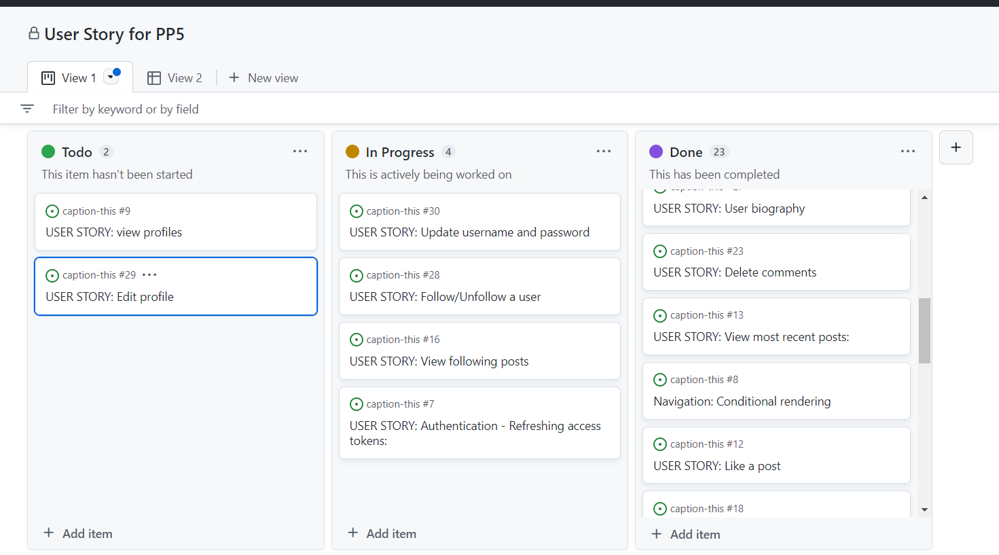

  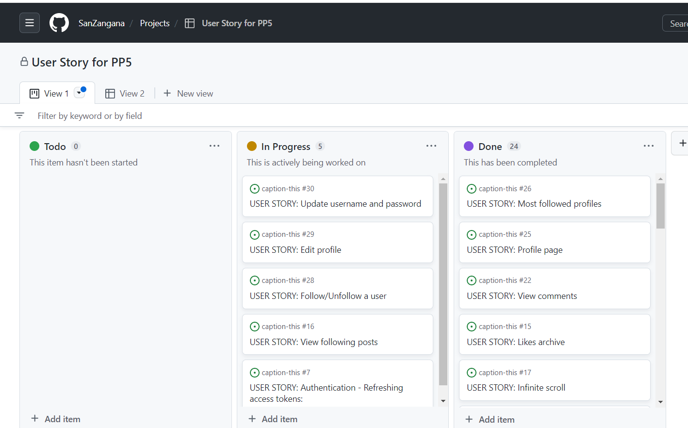

### MoSCoW Prioritization

I've decomposed my Epics into stories prior to prioritizing and implementing them.
Using this approach, I was able to apply the MoSCow prioritization and labels to my user stories within the Issues tab.

- **Must Have**: guaranteed to be delivered (_max 60% of stories_)
- **Should Have**: adds significant value, but not vital (_the rest ~20% of stories_)
- **Could Have**: has small impact if left out (_20% of stories_)
- **Won't Have**: not a priority for this iteration

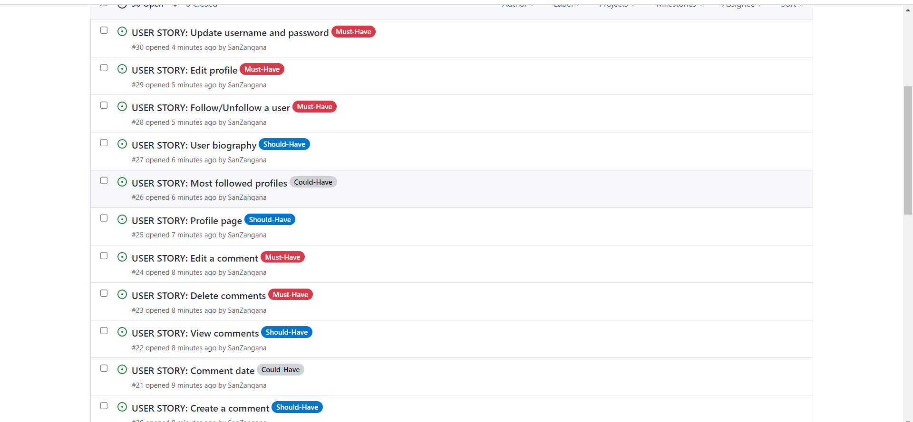

## Testing

For all testing, please refer to the [TESTING.md](TESTING.md) file.

## Deployment

The live deployed application can be found deployed on [Heroku](https://caption-this-react.herokuapp.com).

### ElephantSQL Database

This project uses [ElephantSQL](https://www.elephantsql.com) for the PostgreSQL Database.

To obtain your own Postgres Database, sign-up with your GitHub account, then follow these steps:

- Click **Create New Instance** to start a new database.
- Provide a name (this is commonly the name of the project: caption-this).
- Select the **Tiny Turtle (Free)** plan.
- You can leave the **Tags** blank.
- Select the **Region** and **Data Center** closest to you.
- Once created, click on the new database name, where you can view the database URL and Password.

### Database structure

Down below you can view a database model that was created by using the [DrawSQL](https://drawsql.app/).

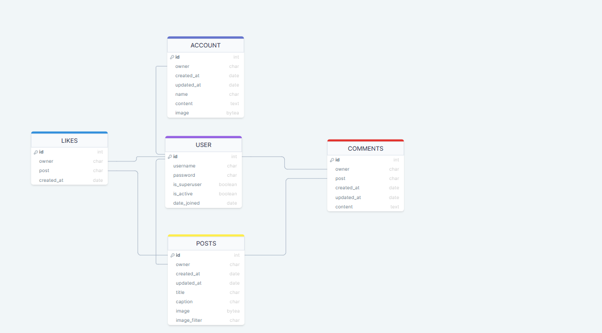

### Heroku Deployment

This project uses [Heroku](https://www.heroku.com), a platform as a service (PaaS) that enables developers to build, run, and operate applications entirely in the cloud.

Deployment steps are as follows, after account setup:

- Select **New** in the top-right corner of your Heroku Dashboard, and select **Create new app** from the dropdown menu.
- Your app name must be unique, and then choose a region closest to you (EU or USA), and finally, select **Create App**.
- From the new app **Settings**, click **Reveal Config Vars**, and set your environment variables.

Heroku needs one additional file in order to deploy properly.

- Procfile

### Local Deployment

#### Cloning

You can clone the repository by following these steps:

1. Go to the [GitHub repository](https://github.com/SanZangana/caption-this)
2. Locate the Code button above the list of files and click it
3. Select if you prefer to clone using HTTPS, SSH, or GitHub CLI and click the copy button to copy the URL to your clipboard
4. Open Git Bash or Terminal
5. Change the current working directory to the one where you want the cloned directory
6. In your IDE Terminal, type the following command to clone my repository:
   - `git clone https://github.com/SanZangana/caption-this.git`
7. Press Enter to create your local clone.

Alternatively, if using Gitpod, you can click below to create your own workspace using this repository.

Please note that in order to directly open the project in Gitpod, you need to have the browser extension installed.
A tutorial on how to do that can be found [here](https://www.gitpod.io/docs/configure/user-settings/browser-extension).

#### Forking

By forking the GitHub Repository, we make a copy of the original repository on our GitHub account to view and/or make changes without affecting the original owner's repository.
You can fork this repository by using the following steps:

1. Log in to GitHub and locate the [GitHub Repository](https://github.com/SanZangana/caption-this)
2. At the top of the Repository (not top of page) just above the "Settings" Button on the menu, locate the "Fork" Button.
3. Once clicked, you should now have a copy of the original repository in your own GitHub account!

## Credits

I want to thank Code Institute for providing me the module from 'Moments' that gave me the inspiration, the tools & the knowledge which resulted with my own first project with ReactJS, 'Caption This'

### Content

Use this space to provide attribution links to any borrowed code snippets, elements, or resources.
A few examples have been provided below to give you some ideas.

Ideally, you should provide an actual link to every resource used, not just a generic link to the main site!

| Source                                                                          | Location           | Notes                                    |
| ------------------------------------------------------------------------------- | ------------------ | ---------------------------------------- |
| [Markdown Builder by Tim Nelson](https://traveltimn.github.io/markdown-builder) | README and TESTING | tool to help generate the Markdown files |
| [Moments]https://github.com/Code-Institute-Solutions/moments)                   | CODE               | The code that inspired me                |

### Acknowledgements

- I would like to thank my Code Institute mentor, [Tim Nelson](https://github.com/username) for their support & for the Markdown Builder!
- I would like to thank the [Code Institute](https://codeinstitute.net) tutor team for their assistance with troubleshooting and debugging some project issues.
- I would like to thank the [Code Institute Slack community](https://code-institute-room.slack.com) for the moral support; it kept me going during periods of self doubt and imposter syndrome.
- Last but not least, my amazing family who supports me and gives me the motivation I need to fulfill my purpose.
