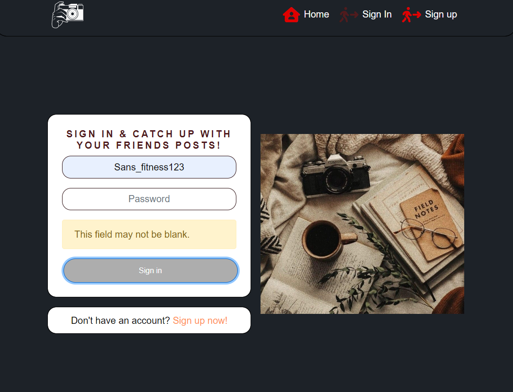

# Testing

Return back to the [README.md](README.md) file.

## Browser Compatibility

To try out the live site, these browsers were used. No abnormal errors appeared while browsing through the site.

- [Chrome](https://www.google.com/chrome)
- [Firefox (Developer Edition)](https://www.mozilla.org/firefox/developer)
- [Edge](https://www.microsoft.com/edge)
- [Safari](https://support.apple.com/downloads/safari)

## Lighthouse Audit

I've tested my deployed project using the Lighthouse Audit tool to check for any major issues.

| Page          | Size    | Screenshot                                       | Notes                                               |
| ------------- | ------- | ------------------------------------------------ | --------------------------------------------------- |
| Home          | Desktop |        | Some minor warnings                                 |
| Liked         | Desktop |       | Few warnings Slow response time due to large images |
| MyAccount     |         |     | Some minor warnings                                 |
| Sign up       | Desktop |  | Few warnings                                        |
| For Your Eyes | Desktop |         | Slow response time due to large images              |

## Defensive Programming

Forms:

- Users cannot submit an empty form
- Users must enter valid email addresses

Django:

- Users cannot brute-force a URL to navigate to a restricted page
- Users cannot perform CRUD functionality while logged-out
- User-A should not be able to manipulate data belonging to User-B, or vice versa
- Non-Authenticated users should not be able to access pages that require authentication
- Standard users should not be able to access pages intended for superusers

Defensive programming was manually tested with the below user acceptance testing:

#### Home Page

| Page                                  | Expected Outcome                                                                   | Pass/Fail |
| ------------------------------------- | ---------------------------------------------------------------------------------- | --------- |
| Navigation Links                      | Clicking on the links will redirect users to the designated pages                  | Pass      |
| Welcome Message Conditional Rendering | Different logged in status will render different welcome messages on the home page | Pass      |

#### Sign Up Page

| Page                  | Expected Outcome                                                                                                          | Pass/Fail |
| --------------------- | ------------------------------------------------------------------------------------------------------------------------- | --------- |
| Sign Up Form          | Filling out the form successfully will create an account                                                                  | Pass      |
| Success Alert Message | If the user created an account, an alert message will appear for 2 seconds letting the user know the account was created. | Pass      |

#### Sign In Page

| Page                  | Expected Outcome                                                                                               | Pass/Fail |
| --------------------- | -------------------------------------------------------------------------------------------------------------- | --------- |
| Sign In Form          | Filling out the form successfully will sign in the user                                                        | Pass      |
| Success Alert Message | If the user signs in successfully, an alert message will appear letting them know they signed in successfully. | Pass      |

#### Add Post Page

| Page     | Expected Outcome                                                 | Pass/Fail |
| -------- | ---------------------------------------------------------------- | --------- |
| Add Post | Filling out the form successfully will create a post by the user | Pass      |

#### Editing Post Page

| Page      | Expected Outcome                                                       | Pass/Fail |
| --------- | ---------------------------------------------------------------------- | --------- |
| Edit Post | Filling out the form successfully will edit a post created by the user | Pass      |

#### Leave A like

| Page      | Expected Outcome                                                                               | Pass/Fail |
| --------- | ---------------------------------------------------------------------------------------------- | --------- |
| Post Page | Clicking the heart icon under a post which is not the user's will icrement the amount of likes | Pass      |

#### Delete A like

| Page      | Expected Outcome                                                                                                                     | Pass/Fail |
| --------- | ------------------------------------------------------------------------------------------------------------------------------------ | --------- |
| Post Page | Clicking the heart icon under a post which is not the user's will decrement the amount of likes if the user already has left a like. | Pass      |

#### Leave A comment

| Page             | Expected Outcome                                                                                  | Pass/Fail |
| ---------------- | ------------------------------------------------------------------------------------------------- | --------- |
| Post Detail Page | Filling out the comment input will leave a comment and increment the amount of comments of a post | Pass      |

#### Edit A comment

| Page             | Expected Outcome                                         | Pass/Fail |
| ---------------- | -------------------------------------------------------- | --------- |
| Post Detail Page | Changing the comment will display the new edited version | Pass      |

#### Delete A Comment

| Page             | Expected Outcome                                                                 | Pass/Fail |
| ---------------- | -------------------------------------------------------------------------------- | --------- |
| Post Detail Page | Deleting a comment will remove it and decrement the amount of comments of a post | Pass      |

#### Edit Profile Avatar and Bio Page

| Page   | Expected Outcome                                               | Pass/Fail |
| ------ | -------------------------------------------------------------- | --------- |
| Avatar | The user can change their avatar image                         | Pass      |
| Bio    | The user can write a bio to be displayed on their profile page | Pass      |

## User Story Testing

### Epic 1 - Account Experience

#### As a user I can create a new account so that I can access all the features for signed up users.

- Sign up feature has been created and is fully functional

#### As a user I can sign in to the app so that I can access functionality for logged in users.

- Sign in feature has been created and is fully functional

#### As a user I can tell if I am logged in or not so that I can log in if I need to.

- Conditional rendering feature has been created, rendering different navlinks depending on the user's logged in status. Messages appear when a user signs in.

#### As a user I can maintain my logged-in status until I choose to log out so that my user experience is not compromised

- User's refresh tokens are active and refresh when the user reloads the page.

### Epic 2 - Profile Experience

#### As a logged in user I can edit my profile so that I can change my profile picture and bio

- The base code for this feature exists, however the axios request request interceptor cannot use the PUT request with the API. A future fix will be implemented, but due to time constraints, it cannot be solved now.

#### As a logged in user I can update my username and password so that I can change my display name and keep my profile secure.

- Features to update usernames and passwords exists and are fully functional

#### As a user I can view statistics about a specific user such as number of posts so that I can learn more about them

- This feature has been created and is fully funtional by clicking on the specific user.

#### As a user I can view user's avatars so that I can easily identify users of the application

- Avatars exist, but due to issues with editing profiles, users cannot change their avatar images.

### Epic 3 - Post Experience

#### As a logged in user I can create posts so that I can share my images with the world!

- The user can add posts by signing in and navigating to the "Add Posts" page.

#### As a post owner I can edit my post title and description so that I can make corrections or update my post after it was created

- Users can click on editing their posts, through the PostDetail page.There they can edit all fields.

### Epic 4 - Navigation Experience

#### As a user I can view a navbar from every page so that navigate easily between pages

- The navbar is fixed to the top of the page, and navigation links provide easy navigation throughout the application.

#### As a logged out user I can see sign in and sign up options so that I can sign in/sign up

- Sign in and Sign out links appear to users that have yet signed in.

#### As a user I can navigate through pages quickly so that view content seamlessly without page refresh

- React router dom has been used to create seamless navigation

#### As a user I can view the details of a single post so that I can learn more about it

- Users can click on posts and be redirected to the post detail page, where they can rate and comments posts.

#### As a user I can view all the most recent posts, ordered by most recently created first so that I am up to date with the newest content

- Users are met with an infinite scroll loop of posts in the home page, sorted latest to oldest.

#### As a user I can read comments on posts so that I can read what other users think about the posts

- Users can read what other users have commentsed on each post in the post detail page.

#### As a user I can view other users profiles so that I can see their posts and learn more about them.

- Users can navigate to specific user's profile pages.

#### As a user I can view all the posts by a specific user so that I can catch up on their latest posts

- In the profile detail page, all the posts made by a user are looped through for anyone to read.

#### As a user I can view the posts page so that I can read the comments about the post

- Users can access the comments of each post by clicking on a specific post.

#### As a user I can keep scrolling through the images on the site, that are loaded for me automatically so that I don't have to click on "next page" etc

- There is an infinite scroll component in the home page that keeps loading posts in the background.

#### As a user, I can search for posts with keywords, so that I can find the posts and user profiles I am most interested in.

- Users can type keywords in the search bar to find specific posts

### Epic 5 - Actions Experience

#### As a logged in user I can rate a post so that I can show my support for the posts that I liked me

- A signed in user can leave likes on posts of their choosing.

#### As an owner of a comment I can delete my comment so that I can control removal of my comment from the application

- A signed in user can delete the comments they have left.

#### As an owner of a comment I can edit my comment so that I can fix or update my existing comment

- User can edit their comments under each post.

#### As a user I can see how long ago a comment was made so that I know how old a comment is

- A feature exists that tracks when a comment was made.

#### As a logged in user I can add comment to a post so that I can share my thoughts about the post

- A signed in user can leave comments on each post.
